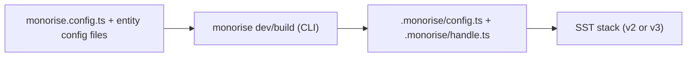
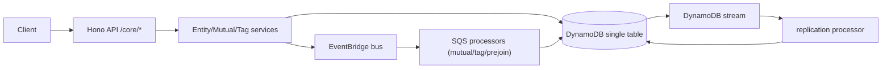
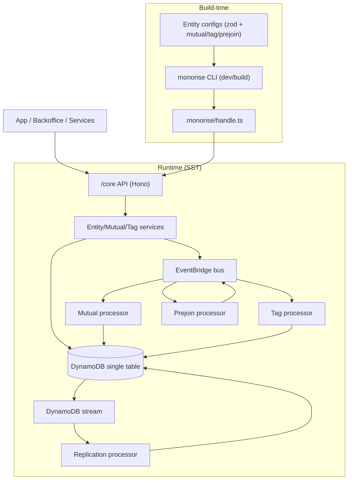

# Monorise

Monorise is an open-source DynamoDB single-table toolkit that powers the core data
layer for applications built on DynamoDB. It provides a shared data model (schemas + relationships), a ready-made API surface (entities, mutuals, tags), and background processors to keep
denormalized access patterns in sync.

## Table of Contents

- [Monorise](#monorise)
  - [Table of Contents](#table-of-contents)
  - [What it solves](#what-it-solves)
  - [Core concepts (mental model)](#core-concepts-mental-model)
  - [Prerequisites](#prerequisites)
  - [Installation](#installation)
  - [Quickstart](#quickstart)
  - [Common commands](#common-commands)
  - [How config becomes a running API](#how-config-becomes-a-running-api)
  - [Runtime flow (high-level)](#runtime-flow-high-level)
  - [End-to-end overview (config -\> runtime -\> data)](#end-to-end-overview-config---runtime---data)
  - [Data layout (short cheat sheet)](#data-layout-short-cheat-sheet)
  - [Public API surface (core)](#public-api-surface-core)
  - [Package map](#package-map)
  - [Where to look next (within this repo)](#where-to-look-next-within-this-repo)
  - [Contributing](#contributing)
  - [License](#license)

## What it solves

- **Single-table DynamoDB modeling** without hand-writing complex queries.
- **Relational-style access** via `Entity`, `Mutual`, and `Tag` concepts.
- **Event-driven maintenance** (mutual/tag/prejoin processors + replication).
- **Shared schema + types** across backend and frontend.

## Core concepts (mental model)

- **Entity**: a first-class record (for example, `learner`, `course`).
- **Mutual**: a relationship record between two entities that can hold data
  (for example, `learner` <-> `course` with progress/role/status).
- **Tag**: a key/value access pattern to quickly query subsets of entities.
- **Prejoin**: computed relationship that "joins" through a chain of mutuals to
  avoid expensive multi-hop queries.

These are defined per entity in config files via `createEntityConfig` (zod-based).
For deeper concept examples, see [Concepts Guide](docs/CONCEPT.MD).

## Prerequisites

- Node.js 20+
- npm 10+
- AWS account/infrastructure context for runtime integration (SST + DynamoDB)

## Installation

Install base packages in your service project:

```bash
npm install @monorise/base @monorise/core @monorise/cli zod hono
```

Install optional packages as needed:

```bash
npm install @monorise/react
npm install @monorise/sst sst
```

If you are working on this monorepo itself:

```bash
npm install
```

## Quickstart

Initialize a project skeleton (creates `monorise.config.ts` and a starter entity):

```bash
npx @monorise/cli init
```

Example entity config:

```ts
import { createEntityConfig } from '@monorise/base';
import { z } from 'zod';

const baseSchema = z.object({
  displayName: z.string().min(1),
});

const config = createEntityConfig({
  name: 'user',
  baseSchema,
});

export default config;
```

Generate Monorise artifacts from your config:

```bash
npx monorise build
```

For watch mode while developing entity configs:

```bash
npx monorise dev
```

This generates `.monorise/config.ts` and `.monorise/handle.ts` for runtime wiring.

## Common commands

From this repository root:

```bash
npm run dev            # watch/build workspace packages
npm run build          # build all packages
npm run start:test-env # start local test dependencies
npm run test           # run core package tests
```

## How config becomes a running API

Monorise uses a small build step to turn entity configs into runnable handlers.



Notes:
- `monorise.config.ts` points to your entity config directory and optional
  custom routes (Hono).
- The CLI writes `.monorise/handle.ts` which exports Lambda handlers used by SST
  (API + processors + replication).

## Runtime flow (high-level)



## End-to-end overview (config -> runtime -> data)



Key behavior:
- **Mutual processor**: creates/updates/removes relationship items in both
  directions with conditional checks and locking.
- **Tag processor**: calculates tag diffs and syncs tag items.
- **Prejoin processor**: walks configured relationship paths and publishes
  derived mutual updates.
- **Replication processor**: keeps denormalized copies aligned via stream
  updates (uses replication indexes).

## Data layout (short cheat sheet)

These are the main access patterns in the single table:

- **Entity metadata**: `PK = <entityType>#<entityId>`, `SK = #METADATA#`
- **Entity list**: `PK = LIST#<entityType>`, `SK = <entityType>#<entityId>`
- **Mutual records**: a primary `MUTUAL#<id>` item plus two directional lookup
  items (`byEntity -> entity` and the reverse).
- **Tag records**: `PK = TAG#<entityType>#<tagName>[#group]`,
  `SK = <sortValue?>#<entityType>#<entityId>` plus reverse lookup by entity.
- **Unique fields**: `PK = UNIQUE#<field>#<value>`, `SK = <entityType>`

The replication indexes (`R1PK/R2PK`) support fast updates of denormalized items.

## Public API surface (core)

The default Hono API exposes:

- `GET/POST /core/entity/:entityType`
- `GET/PUT/PATCH/DELETE /core/entity/:entityType/:entityId`
- `GET/POST/PATCH/DELETE /core/mutual/:byEntityType/:byEntityId/:entityType/:entityId`
- `GET /core/tag/:entityType/:tagName`

Custom routes can be mounted under `/core/app/*` via `customRoutes`.

## Package map

| Package | Role |
|---|---|
| `@monorise/base` | Entity config + schema/types (zod). |
| `@monorise/core` | Hono API, DynamoDB repositories, processors, event utils. |
| `@monorise/cli` | Generates `.monorise/config.ts` + `.monorise/handle.ts`. |
| `@monorise/react` | Client SDK, hooks, stores, axios helpers. |
| `@monorise/sst` | SST v3 module: API, bus, table, queues, processors. |

## Where to look next (within this repo)

- Core API + processors: `packages/core/*`
- SST v3 module: `packages/sst/*`
- CLI generator: `packages/cli/*`
- Shared types: `packages/base/*`
- React SDK: `packages/react/*`

## Contributing

See [contributing guide](CONTRIBUTING.md) for workflow, changesets, and PR guidelines.

## License

Distributed under the MIT License. See `LICENSE`.
