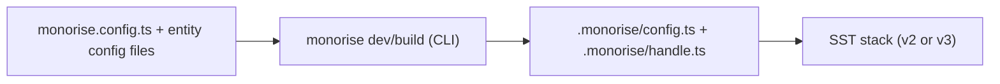
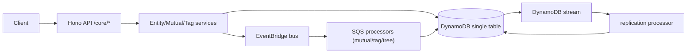
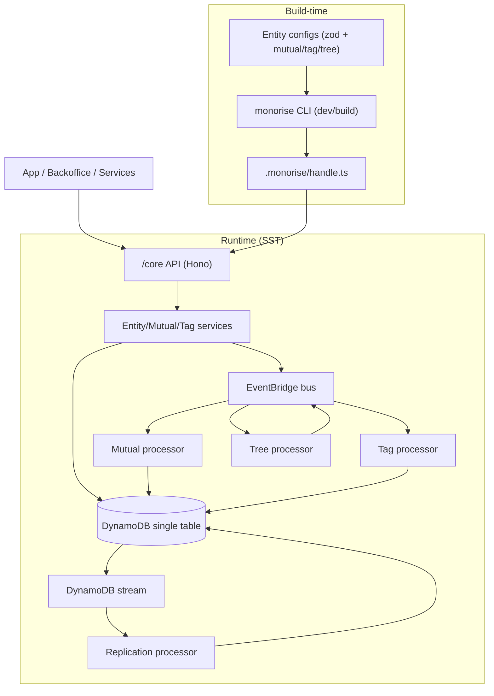

# Monorise

<p align="center">
  <strong>DynamoDB Single-Table Toolkit</strong><br/>
  Type-safe, event-driven data layer for applications built on DynamoDB.
</p>

<p align="center">
  <a href="https://monorise.dev">📚 Documentation</a> •
  <a href="https://monorise.dev/getting-started">🚀 Quickstart</a> •
  <a href="https://monorise.dev/concepts">💡 Concepts</a> •
  <a href="https://github.com/monorist/monorise/issues">💬 Issues</a>
</p>

---

## What is Monorise?

Monorise is an open-source toolkit that powers the core data layer for applications built on DynamoDB. Define your data models with Zod schemas, and get:

- **A ready-made REST API** for entities, relationships, and queries
- **Event-driven processors** that keep denormalized data in sync
- **Full type safety** from backend to frontend
- **SST v3 integration** for one-command deployment to AWS

## Full-Stack in Minutes

**1. Create your project:**

```bash
npx monorise init --name my-app
cd my-app
```

**2. Define your entity:**

```ts
// monorise/configs/member.ts
import { createEntityConfig } from 'monorise/base';
import { z } from 'zod/v4';

const baseSchema = z.object({
  name: z.string(),
  email: z.string().email(),
  role: z.enum(['admin', 'member']),
}).partial();

export default createEntityConfig({
  name: 'member',
  displayName: 'Member',
  baseSchema,
  searchableFields: ['name', 'email'],
  uniqueFields: ['email'],
});
```

**3. Query from React:**

```tsx
// apps/web/src/app/page.tsx
import { useEntities, createEntity } from 'monorise/react';
import { Entity } from '#/monorise/config';

export default function MembersPage() {
  const { entities: members, isLoading } = useEntities(Entity.MEMBER);

  return (
    <div>
      {members?.map((m) => (
        <div key={m.entityId}>{m.data.name} — {m.data.email}</div>
      ))}
    </div>
  );
}
```

That's it — relational queries on DynamoDB without the design doc. Single-table performance without the single-table pain.

## Quickstart

```bash
# Create a new project with everything set up
npx monorise init --name my-app

# Start development
cd my-app
npx sst dev

# Deploy to production
npx sst deploy --stage prod
```

`monorise init` scaffolds a production-ready monorepo:

```
my-app/
├── apps/web/                        # Next.js frontend
│   └── src/
│       ├── app/
│       │   ├── layout.tsx           # GlobalInitializer + GlobalLoader wired in
│       │   ├── page.tsx             # Example page with useEntities
│       │   ├── globals.css          # Shadcn theme variables
│       │   └── api/
│       │       ├── proxy-request.ts # API proxy utility
│       │       └── [...proxy]/route.ts  # Catch-all proxy to monorise backend
│       ├── components/
│       │   ├── global-initializer.tsx   # Monorise store config
│       │   ├── global-loader.tsx        # Interruptive loading overlay
│       │   └── ui/                      # Shadcn UI (button, card, input, label)
│       └── lib/utils.ts             # cn() helper
├── services/core/
│   └── routes.ts                    # Hono backend routes
├── monorise/configs/
│   └── user.ts                      # Starter entity definition
├── sst.config.ts                    # SST + Monorise configured
└── .monorise/                       # Generated types
```

Read the [Getting Started Guide](https://monorise.dev/getting-started) for the complete walkthrough.

## Why Monorise?

| Feature | Description |
|---------|-------------|
| **🗄️ Single-Table DynamoDB** | One table, O(1) performance for every query. Denormalization handled automatically. |
| **🔄 Zero Schema Drift** | One Zod config drives DB, backend, and frontend. `monorise dev` auto-regenerates types on every change. |
| **🚀 Ship in Hours** | From `git init` to production API. No migration scripts, no access pattern spreadsheets.
| **🔗 Relational Patterns** | Entity, Mutual, and Tag concepts for relational-style queries on DynamoDB. |
| **📦 Full-Stack SDK** | Backend (Hono), React hooks, SST v3 infrastructure — one package. |
| **🧠 Token-Efficient** | Built-in CRUD, relationships, and tagging. Less code to write, fewer tokens to generate/review. |

## Core Concepts

- **[Entity](https://monorise.dev/concepts/entities)** — A first-class record (e.g., `user`, `order`)
- **[Mutual](https://monorise.dev/concepts/mutuals)** — A relationship between two entities with optional data (e.g., `learner` enrolled in `course`)
- **[Tag](https://monorise.dev/concepts/tags)** — Key/value access patterns for fast querying
- **[Tree](https://monorise.dev/concepts/trees)** — Computed relationships that avoid multi-hop queries

## Documentation

- **[Getting Started](https://monorise.dev/getting-started)** — Installation, configuration, and first steps
- **[Concepts](https://monorise.dev/concepts)** — Understanding Entities, Mutuals, Tags, and Trees
- **[SST SDK](https://monorise.dev/sst)** — Infrastructure and deployment reference
- **[React SDK](https://monorise.dev/react)** — Frontend hooks and utilities
- **[Best Practices](https://monorise.dev/best-practices)** — Security patterns and recommendations
- **[FAQ](https://monorise.dev/faq)** — Common questions and answers

## Architecture Overview

```
┌─────────┐     ┌─────────────┐     ┌─────────────────┐
│  Client │────▶│  Hono API   │────▶│ Entity/Mutual/  │
│         │     │  /core/*    │     │ Tag Services    │
└─────────┘     └─────────────┘     └────────┬────────┘
                                             │
                         ┌───────────────────┴──────────┐
                         ▼                              ▼
                  ┌─────────────┐              ┌────────────────┐
                  │  DynamoDB   │◀────────────▶│  EventBridge   │
                  │ Single Table│              │     Bus        │
                  └─────────────┘              └───────┬────────┘
                                                       │
                              ┌────────────────────────┼────────────────────────┐
                              ▼                        ▼                        ▼
                       ┌─────────────┐          ┌─────────────┐          ┌─────────────┐
                       │ SQS Mutual  │          │  SQS Tag    │          │  SQS Tree   │
                       │  Processor  │          │  Processor  │          │  Processor  │
                       └─────────────┘          └─────────────┘          └─────────────┘
```

See [Architecture](https://monorise.dev/architecture) for the detailed design.

## Project Structure

```
├── packages/
│   ├── base/          # Entity config + schemas (Zod)
│   ├── core/          # Hono API, DynamoDB repos, processors
│   ├── cli/           # CLI for generating artifacts
│   ├── react/         # React hooks and client SDK
│   └── sst/           # SST v3 infrastructure module
├── www/               # Documentation site (VitePress)
└── examples/          # Example projects
```

## How config becomes a running API

Monorise uses a small build step to turn entity configs into runnable handlers.


```mermaid
flowchart LR
  Config["monorise.config.ts + entity config files"] --> CLI["monorise dev/build (CLI)"]
  CLI --> Out[".monorise/config.ts + .monorise/handle.ts"]
  Out --> SST["SST stack (v2 or v3)"]
```

Notes:
- `monorise.config.ts` points to your entity config directory and optional
  custom routes (Hono).
- The CLI writes `.monorise/handle.ts` which exports Lambda handlers used by SST
  (API + processors + replication).

## Runtime flow (high-level)


```mermaid
flowchart LR
  Client --> Api["Hono API /core/*"]
  Api --> CoreSvc["Entity/Mutual/Tag services"]
  CoreSvc --> DDB[(DynamoDB single table)]
  CoreSvc --> Bus["EventBridge bus"]
  Bus --> SQS["SQS processors (mutual/tag/tree)"]
  SQS --> DDB
  DDB --> Stream["DynamoDB stream"]
  Stream --> Replicator["replication processor"]
  Replicator --> DDB
```

## End-to-end overview (config -> runtime -> data)


```mermaid
flowchart TB
  subgraph Build["Build-time"]
    Config["Entity configs (zod + mutual/tag/tree)"]
    Cli["monorise CLI (dev/build)"]
    Handle[".monorise/handle.ts"]
    Config --> Cli --> Handle
  end

  subgraph Runtime["Runtime (SST)"]
    API["/core API (Hono)"]
    Services["Entity/Mutual/Tag services"]
    Table[(DynamoDB single table)]
    Bus["EventBridge bus"]
    MutualQ["Mutual processor"]
    TagQ["Tag processor"]
    TreeQ["Tree processor"]
    Stream["DynamoDB stream"]
    Replicator["Replication processor"]
  end

  Client["App / Backoffice / Services"] --> API
  Handle --> API
  API --> Services --> Table
  Services --> Bus
  Bus --> MutualQ --> Table
  Bus --> TagQ --> Table
  Bus --> TreeQ --> Bus
  Table --> Stream --> Replicator --> Table
```

Key behavior:
- **Mutual processor**: creates/updates/removes relationship items in both
  directions with conditional checks and locking.
- **Tag processor**: calculates tag diffs and syncs tag items.
- **Tree processor**: walks configured relationship paths and publishes
  derived mutual updates.
- **Replication processor**: keeps denormalized copies aligned via stream
  updates (uses replication indexes).

## Data layout (short cheat sheet)

These are the main access patterns in the single table:

- **Entity metadata**: `PK = <entityType>#<entityId>`, `SK = #METADATA#`
- **Entity list**: `PK = LIST#<entityType>`, `SK = <entityType>#<entityId>`
- **Mutual records**: a primary `MUTUAL#<id>` item plus two directional lookup
  items (`byEntity -> entity` and the reverse).
- **Tag records**: `PK = TAG#<entityType>#<tagName>[#group]`,
  `SK = <sortValue?>#<entityType>#<entityId>` plus reverse lookup by entity.
- **Unique fields**: `PK = UNIQUE#<field>#<value>`, `SK = <entityType>`

The replication indexes (`R1PK/R2PK`) support fast updates of denormalized items.

## Public API surface (core)

The default Hono API exposes:

- `GET/POST /core/entity/:entityType`
- `GET/PUT/PATCH/DELETE /core/entity/:entityType/:entityId`
- `GET/POST/PATCH/DELETE /core/mutual/:byEntityType/:byEntityId/:entityType/:entityId`
- `GET /core/tag/:entityType/:tagName`

Custom routes can be mounted under `/core/app/*` via `customRoutes`.

`PATCH /core/entity/:entityType/:entityId` supports optional conditional
preconditions through a top-level `$where` object. This lets you do atomic
compare-and-set style updates.

## Conditional PATCH updates (atomic $where)

Use `$where` in `PATCH /core/entity/:entityType/:entityId` when updates should
only apply if current values match your preconditions. Monorise compiles this
to a DynamoDB `ConditionExpression` and executes it atomically in one write.

Without `$where` (existing behavior):

```json
{
  "status": "confirmed"
}
```

With `$where`:

```json
{
  "status": "confirmed",
  "confirmedAt": "2026-04-13T00:00:00.000Z",
  "$where": {
    "status": { "$eq": "pending" },
    "retryCount": { "$lt": 3 }
  }
}
```

Shorthand equality is supported:

```json
{
  "status": "confirmed",
  "$where": {
    "status": "pending"
  }
}
```

All `$where` clauses are combined with `AND`.

Supported operators:

| Operator | Meaning |
|---|---|
| `$eq` | Equals |
| `$ne` | Not equals |
| `$gt` | Greater than |
| `$lt` | Less than |
| `$gte` | Greater than or equal |
| `$lte` | Less than or equal |
| `$exists` | Field exists / does not exist |
| `$beginsWith` | String prefix match |

Response behavior for PATCH:

- `200 OK`: update applied
- `409 CONFLICT`: `$where` precondition failed (`CONDITIONAL_CHECK_FAILED`)
  - in conditional mode, this also includes missing entities
- `404 NOT_FOUND`: entity missing in non-conditional mode
- `400 BAD_REQUEST`: validation errors and unique-value conflicts

Compatibility notes:

- Existing PATCH clients continue to work unchanged (no `$where` required).
- Top-level `$where` is reserved for conditional update semantics.

## Package map

| Package | Role |
|---|---|
| `@monorise/base` | Entity config + schema/types (zod). |
| `@monorise/core` | Hono API, DynamoDB repositories, processors, event utils. |
| `@monorise/cli` | Generates `.monorise/config.ts` + `.monorise/handle.ts`. |
| `@monorise/react` | Client SDK, hooks, stores, axios helpers. |
| `@monorise/sst` | SST v3 module: API, bus, table, queues, processors. |

## Where to look next (within this repo)

- Core API + processors: `packages/core/*`
- SST v3 module: `packages/sst/*`
- CLI generator: `packages/cli/*`
- Shared types: `packages/base/*`
- React SDK: `packages/react/*`

## Contributing

See [Contributing Guide](CONTRIBUTING.md) for workflow, changesets, and PR guidelines.

## License

Distributed under the MIT License. See [LICENSE](./LICENSE).
